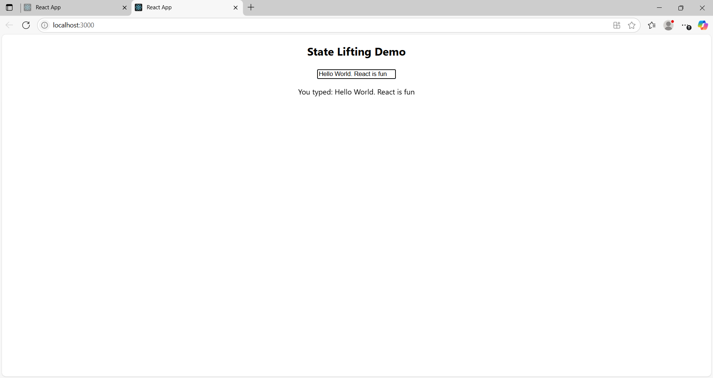

# 🧠 Lifting State Demo – React

A simple React project that demonstrates **lifting state up** between components. Useful for beginners learning how parent and child components share state in React.

## 📸 Screenshot

  

## 🛠 Features

- React functional components
- State management with `useState`
- Controlled input component
- Real-time data passing between siblings

## 🧱 Folder Structure

lifting-state-demo/
├── src/
│ ├── InputComponent.js
│ ├── DisplayComponent.js
│ └── Parent.js
├── public/
├── README.md
└── package.json

## 📦 How to Run Locally

# Clone the repository
git clone https://github.com/luckaty/lifting-state-demo.git

# Navigate to the project
cd lifting-state-demo

# Install dependencies
npm install

# Start development server
npm start

The app will run at http://localhost:3000.
🤝 Contributing

Feel free to fork, star ⭐, or contribute by submitting issues or pull requests.

    Built with ❤️ by Blessed Ogechukwu
